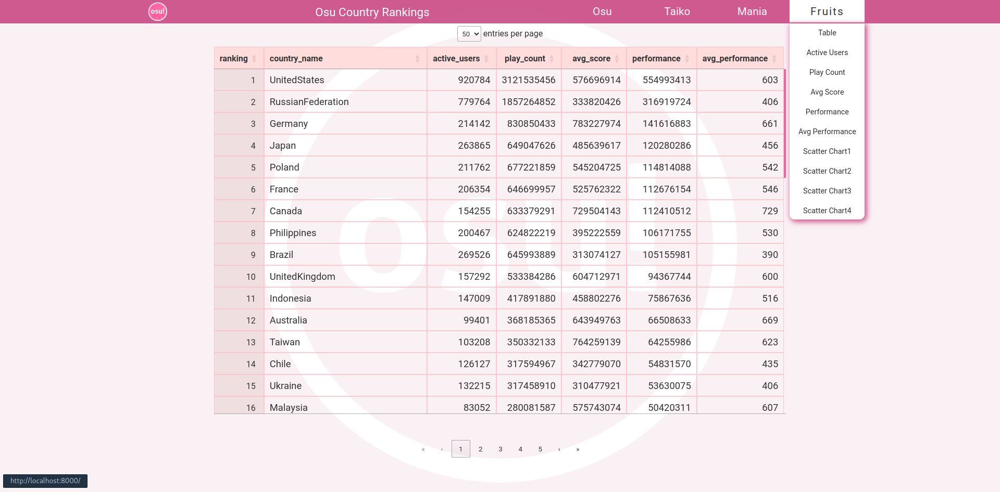
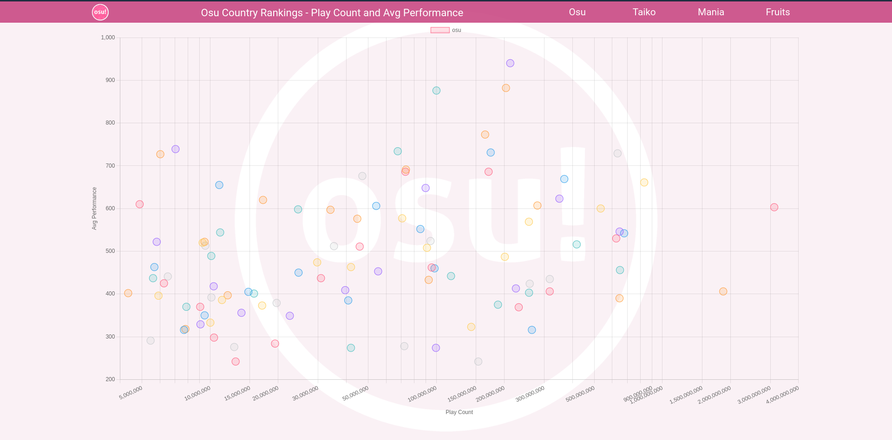

# osu! Rankings Crawler

This repository contains an osu rankings crawler that gathers and displays ranking data from the osu! Country Rankings.

**Website:** [https://osu-rankings-crawler.onrender.com](https://osu-rankings-crawler.onrender.com)

**Data Source:** [osu! Country Rankings](https://osu.ppy.sh/rankings/osu/country)

## Features
- Crawl and collect ranking data from osu!
- Store data in an SQLite database
- Display data using a Flask web application
- Visualize data using Chart.js and DataTables

## View



## Getting Started

### Prerequisites
Ensure you have Python and `pip` installed.

### Installation

1. **Install Packages** 
    ```bash
    pip install -r requirements.txt
    ```

2. **Initialize Database**
    ```bash
    # Remove previous database and create a new one
    python init_db.py
    ```

3. **Crawl Rankings**
    ```bash
    python crawl_all.py
    ```

4. **Run Server for Debugging**
    ```bash
    python main.py --debug
    ```
5. **Run Server**
    ```bash
    python main.py
    ```


## Usage

After running the server, open your browser and navigate to `http://127.0.0.1:8000` (default) to view the rankings.

## References

### Scrapy
- [Scrapy Tutorial by Chungmin Yu](https://hackmd.io/@chungmin-yu/Sy_e3w5hi?utm_source=preview-mode&utm_medium=rec)

### Flask + SQLite
- [DigitalOcean: Using SQLite with Flask](https://www.digitalocean.com/community/tutorials/how-to-use-an-sqlite-database-in-a-flask-application)
- [Medium: Flask with SQLite by PyLadies Taiwan](https://medium.com/pyladies-taiwan/%E5%A6%82%E4%BD%95%E5%9C%A8-flask-%E4%BD%BF%E7%94%A8-sqlite-%E8%B3%87%E6%96%99%E5%BA%AB-c26f300f1d87)
- [Yanwei Liu: Flask with SQLite](https://yanwei-liu.medium.com/python%E7%B6%B2%E9%A0%81%E8%A8%AD%E8%A8%88-flask%E4%BD%BF%E7%94%A8%E7%AD%86%E8%A8%98-%E4%BA%8C-89549f4986de)
- [HackMD: SQLite with Flask by Shaoe Chen](https://hackmd.io/@shaoeChen/rJnJWaq1z?type=view)
- [HackMD: Another SQLite with Flask by Shaoe Chen](https://hackmd.io/@shaoeChen/B1Fg-6j-z?type=view)
- [iThome: Using SQLite with Flask](https://ithelp.ithome.com.tw/articles/10264625)

### Chart.js
- [Chart.js Bar Charts](https://www.chartjs.org/docs/latest/charts/bar.html)
- [Chart.js Axes](https://www.chartjs.org/docs/latest/axes/)

### DataTables
- [iThome: DataTables Tutorial](https://ithelp.ithome.com.tw/articles/10272439)

### Ajax
- [Eudora: Ajax Guide](https://www.eudora.cc/posts/26119)

## Contribution

Contributions are welcome! Please open an issue or submit a pull request for any improvements or bug fixes.

## License

This project is licensed under the MIT License - see the [LICENSE](LICENSE) file for details.
